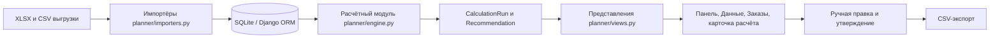

# SupplyFlow — планирование закупок и контроль запасов

Веб-сервис для менеджера по закупкам. Он преобразует выгрузки продаж и складских данных в объяснимый черновик заказа поставщику: **что заказать, в каком количестве, почему и насколько срочно**.

Проект создан для кейса автоматизации формирования заказов поставщикам. В репозитории реализован локальный MVP на Django для наборов данных **Systeme Electric** и **IEK**.

## Проблема и целевая аудитория

Менеджер по закупкам сводит продажи, остатки, минимальные партии и товары в пути в Excel. Расчёт получается редким, трудоёмким и плохо защищённым от разовых крупных продаж, сезонности и дефицитов на складе.

Сервис предназначен для менеджера по закупкам. Он создаёт единый проверяемый маршрут: загрузка данных → расчёт → проверка рисков и правок → утверждение → выгрузка заказа.

## Что реализовано

### Работа с данными

- Импорт предоставленных XLSX-выгрузок Systeme Electric и IEK.
- Импорт CSV для актуальных остатков, периодов отсутствия товара и справочника категорий/единиц измерения.
- Сохранение версии импорта: имени файла, контрольной суммы, даты, числа строк и предупреждений. Повторная загрузка файла с той же контрольной суммой не дублирует данные.
- Сохранение кода 1С как текста, поэтому ведущие нули и суффиксы SKU не теряются.
- Проверка структуры загружаемых файлов и ограничение размера файла до 30 МБ.
- Защита приватности: транзакционная выгрузка с полями `клиент`, `фио` или `имя клиента` отклоняется. Для анализа клиента поддерживается только обезличенный `customer_hash`.

### Расчёт потребности

- Прогноз по SKU на горизонт «срок поставки + период пересмотра».
- Сезонность из количественной помесячной истории: сначала для SKU, при недостатке полной истории — по категории, иначе нейтральный коэффициент.
- Устойчивый рост спроса: сравнение последних трёх месяцев с аналогичным периодом прошлого года; рост ограничивается параметром политики закупки.
- Компенсация упущенного спроса в зафиксированные периоды stockout.
- Поиск и исключение разовых крупных продаж по документу или `customer_hash`. Исключение применяется, только если транзакции за месяц согласуются с помесячным отчётом; при расхождении позиция блокируется.
- Учёт свободного остатка, поступлений до конца горизонта, страхового запаса, MOQ, кратности упаковки и коэффициента пересчёта закупочной единицы в складскую.
- Расчёт срочности по числу дней покрытия запасом.

### Работа закупщика

- Панель с показателями расчёта и графиками спроса за 12 месяцев, срочности, структуры заказа по категориям и факторов корректировки.
- Список последних расчётов по поставщикам.
- Объяснение по каждой SKU: прогноз, запас, свободный остаток, поставки в пути, сезонность, рост, stockout, округление и блокирующие проблемы.
- Поиск, фильтры «к заказу / требуют проверки / все позиции» и постраничный вывод.
- Ручная правка количества с обязательной причиной, автором и датой изменения.
- Финальная сводка перед утверждением: объём заказа, высокий риск, ручные правки и блокировки.
- Утверждение доступно только пользователю с правом `planner.can_approve_order` и только при отсутствии блокировок.
- Экспорт утверждённого заказа в CSV с кодом 1С, артикулом, наименованием, количеством, единицей измерения и поставщиком.
- Django Admin для справочников, политик, остатков, stockout-периодов, импортов и аудита расчётов.

## Как работает решение

1. Менеджер входит в сервис и открывает страницу **«Данные»**.
2. Сервис показывает последние версии источников и таблицу готовности данных по каждому поставщику: продажи, свободные остатки, MOQ, политика запаса, товары в пути, stockout и обезличенный идентификатор клиента.
3. На странице **«Панель»** менеджер выбирает поставщика, дату расчёта, склад и при необходимости категорию.
4. Сервис создаёт сохранённый черновик расчёта. Для каждой SKU рассчитывается потребность и формируется объяснение результата.
5. На панели менеджер анализирует графики. На странице **«Заказы»** открывает расчёт нужного поставщика и проверяет строки заказа.
6. При необходимости менеджер корректирует количество и указывает причину правки.
7. Пользователь с правом утверждения проверяет финальную сводку и утверждает черновик. При проблемах с входными данными утверждение блокируется.
8. После утверждения доступен CSV-файл для дальнейшей работы в учётной системе. Автоматической отправки заказа поставщику в проекте нет.

### Логика расчёта

Для каждой позиции рассчитывается:

```text
Потребность = прогноз на горизонт поставки
            + страховой запас
            − свободный остаток
            − подтверждённые поступления до конца горизонта
```

Полученная потребность переводится в закупочную единицу, поднимается до MOQ и округляется до кратности упаковки. В строке заказа сохраняются исходная величина до округления и итоговое количество.

## Архитектура



| Компонент | Назначение |
| --- | --- |
| `planner/models.py` | Модели поставщиков, товаров, продаж, запасов, поставок в пути, stockout, политик, расчётов и рекомендаций. |
| `planner/importers.py` | Адаптеры форматов предоставленных Excel-файлов и CSV. |
| `planner/engine.py` | Детерминированный и объяснимый алгоритм прогноза и расчёта заказа. |
| `planner/views.py` | Пользовательский сценарий: панели, импорт, расчёт, правка, утверждение и экспорт. |
| `planner/templates/planner/` | Адаптивный русскоязычный интерфейс на HTML/CSS; графики строятся сервером в SVG. |
| `planner/admin.py` | Настройка и аудит данных через Django Admin. |
| `planner/tests.py` | Автоматические проверки расчёта и HTTP-экранов сервиса. |
| `source_audit.py`, `source_metrics.py`, `source_deep.py` | Read-only скрипты аудита структуры и качества исходных XLSX. |

## Технологии

| Технология | Назначение |
| --- | --- |
| Python 3.11 | Язык приложения, импорта и расчётного алгоритма. |
| Django 5.2 | Веб-приложение, маршрутизация, шаблоны, формы, аутентификация, права, админка и ORM. |
| SQLite | Локальная база данных в файле `db.sqlite3`. |
| openpyxl 3.1 | Чтение XLSX-выгрузок. |
| HTML, CSS, серверный SVG | Интерфейс и графики без зависимости от JavaScript. |
| Django TestCase | Автоматические тесты бизнес-логики и HTTP-экранов. |

В проекте **не используются AI-модели, внешние API, облачные сервисы, брокеры сообщений или сторонние аналитические платформы**. Алгоритм намеренно детерминированный: факторы расчёта сохраняются в строке рекомендации и доступны закупщику.

## Установка и запуск

### Требования

- Windows и PowerShell;
- Python 3.11;
- папка с предоставленными материалами, содержащая каталоги `Systeme electric` и `IEK`.

### Команды

В PowerShell перейдите в корень репозитория:

```powershell
cd C:\Users\Alex\Desktop\HackAlem
```

Создайте окружение, установите зависимости и примените миграции:

```powershell
py -3.11 -m venv .venv311
.\.venv311\Scripts\python.exe -m pip install -r requirements.txt
.\.venv311\Scripts\python.exe manage.py migrate
```

Импортируйте предоставленные файлы и создайте синтетический набор для сквозной демонстрации:

```powershell
.\.venv311\Scripts\python.exe manage.py import_samples --source-root 'C:\Users\Alex\Desktop\материалы HackAlem'
.\.venv311\Scripts\python.exe manage.py seed_demo
```

Создайте пользователя администратора и запустите сервер:

```powershell
.\.venv311\Scripts\python.exe manage.py createsuperuser
.\.venv311\Scripts\python.exe manage.py runserver
```

Откройте [http://127.0.0.1:8000/](http://127.0.0.1:8000/) и войдите под созданной учётной записью.

Полезные команды:

```powershell
# Проверка приложения
.\.venv311\Scripts\python.exe manage.py check

# Автоматические тесты
.\.venv311\Scripts\python.exe manage.py test planner

# Повторный импорт, включая файлы с прежней контрольной суммой
.\.venv311\Scripts\python.exe manage.py import_samples --source-root 'C:\Users\Alex\Desktop\материалы HackAlem' --force
```

## Как проверить решение

Полный сценарий жюри можно повторить без изменения исходных Excel-файлов.

1. Выполните команды установки, импорта и `seed_demo` из раздела выше.
2. Войдите на сайт и на странице **«Данные»** откройте таблицу «Готовность данных к расчёту».
3. На **«Панели»** выберите поставщика **«Демо: синтетические данные»**, дату `2026-09-22` и склад `Все`. Нажмите «Сформировать рекомендации».
4. На странице расчёта проверьте блок «Финальная проверка заказа» и раскройте «Показатели расчёта» у строк.
5. Убедитесь, что у демонстрационных SKU отражаются разные факторы:

   - `DEMO-SEASON` — выраженная сезонность и поступление в пути;
   - `DEMO-BULK` — исключение разовой крупной продажи;
   - `DEMO-STOCKOUT` — компенсация периода отсутствия товара.

6. Измените количество одной позиции, укажите причину и сохраните правку. В финальной сводке увеличится число ручных изменений.
7. Утвердите заказ под суперпользователем и скачайте CSV.
8. Запустите `manage.py test planner`. В проекте выполняется 11 тестов: сезонность, stockout, аномалии, остатки и поступления, MOQ, политика категории, права на утверждение, ручная правка, экспорт и основные экраны.

## Данные и интеграции

### Предоставленные источники

Импортирующая команда поддерживает следующие файлы:

| Поставщик | Используемые источники |
| --- | --- |
| Systeme Electric | MOQ/кратность, помесячные продажи в штуках, помесячные остатки, динамика продаж по документам, сводный файл на 22.09.2026 со свободными остатками и товаром в пути. |
| IEK | MOQ, помесячные продажи в штуках, помесячные остатки, динамика продаж по документам, файл товара в пути с ожидаемыми датами. |

Файлы сезонности из материалов содержат выручку на уровне поставщика. Они не используются для количественного прогноза SKU: сервис рассчитывает сезонность из помесячных продаж в штуках.

Также поддерживаются CSV:

| Тип | Обязательные поля |
| --- | --- |
| Актуальные остатки | `sku, warehouse, as_of, on_hand, reserved, free` |
| Stockout-периоды | `sku, warehouse, starts, ends` |
| Каталог и единицы | `sku` и изменяемые поля `category, article, name, unit, min_order, pack_multiple, purchase_to_stock_factor` |

Исходные XLSX-файлы не копируются в репозиторий и не включаются в Git. Сервис не обращается к внешним API. Выгрузка заказа — универсальный CSV с разделителем `;` и UTF-8 BOM для удобного открытия в Excel.

## Ограничения текущей версии

- Решение является локальным MVP и использует SQLite. Производственное развёртывание, PostgreSQL, резервное копирование и настройка веб-сервера не реализованы.
- В предоставленных материалах нет актуального свободного остатка IEK на дату расчёта. Можно показать расчёт с начальным остатком месяца, но утверждение таких строк блокируется.
- В исходных материалах нет периодов stockout. Поэтому для реальных строк компенсация упущенного спроса равна нулю; функция проверяется на синтетическом наборе.
- В исходных транзакциях нет `customer_hash`. Система находит разовые продажи по документам, но не может объединить несколько документов одного клиента.
- В части транзакционных и помесячных данных есть расхождения. Сервис не вычитает аномалии из несогласованного месяца и показывает блокировку.
- Для части номенклатуры IEK неизвестен коэффициент перевода закупочной единицы в складскую, например бухты в метры. Такие позиции блокируются.
- Цена может быть импортирована в `unit_price`, но не участвует в оптимизации бюджета или маржинальности.
- Экспорт CSV содержит поля, необходимые для проверки заказа, но точный формат импорта в конкретную конфигурацию 1С не реализован.
- Нет автоматической отправки заказа поставщику. Это соответствует ограничению кейса: заказ требует подтверждения ответственного сотрудника.
- Политики поставщиков после импорта создаются с рабочим допущением `30 / 30 / 15` дней и имеют статус `confirmed=False`. Их принятие выполняется ответственным пользователем в Django Admin.

## Развёрнутая версия

Публичная deployed-версия в текущем репозитории отсутствует. Проект запускается локально по адресу `http://127.0.0.1:8000/`.
